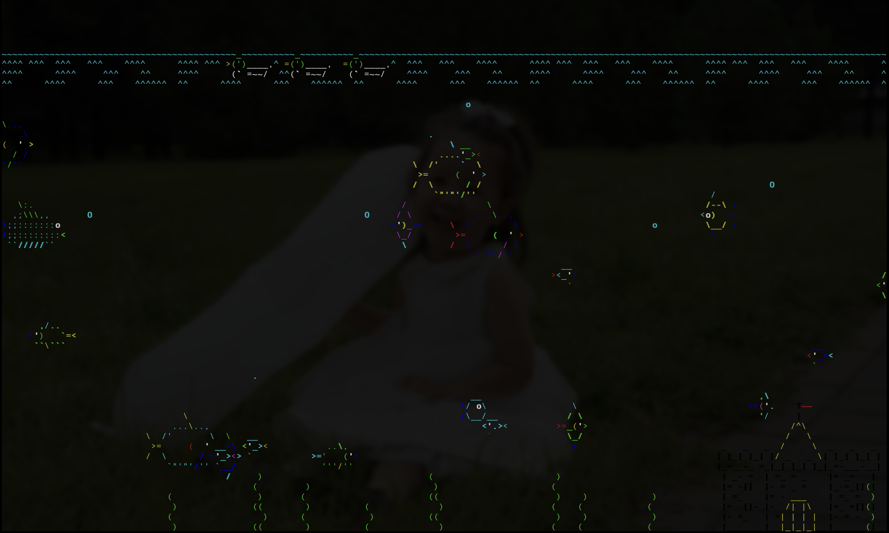
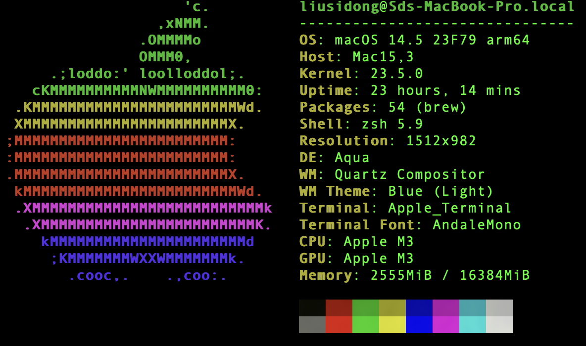
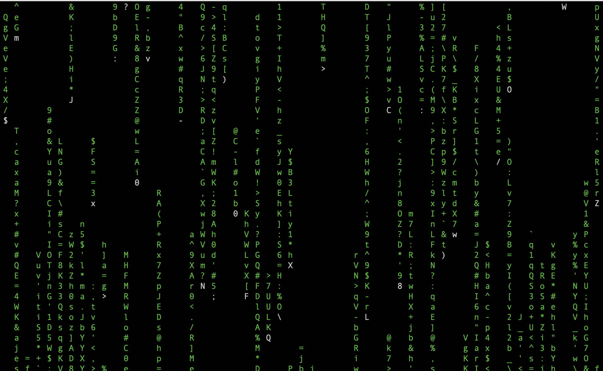

# command_tools
Some interesting command line for macOS (maybe also valid for Linux). 

# 1. asciiquarium

```sh
brew install asciiquarium

```




# 2. boxes
```sh
brew install boxes
```

```sh
echo "Hello." | boxes -d cat

            /\             /\
           |`\\_,--="=--,_//`|
           \ ."  :'. .':  ". /
          ==)  _ :  '  : _  (==
            |>/O\   _   /O\<|
            | \-"~` _ `~"-/ |   jgs
           >|`===. \_/ .===`|<
     .-"-.   \==='  |  '===/   .-"-.
.---{'. '`}---\,  .-'-.  ,/---{.'. '}---.
 )  `"---"`     `~-===-~`     `"---"`  (
(  Hello.                               )
 )                                     (
'---------------------------------------'
```
```sh
echo "Hello." | boxes -d dog

          __   _,--="=--,_   __
         /  \."    .-.    "./  \
        /  ,/  _   : :   _  \/` \
        \  `| /o\  :_:  /o\ |\__/
         `-'| :="~` _ `~"=: |
            \`     (_)     `/ jgs
     .-"-.   \      |      /   .-"-.
.---{     }--|  /,.-'-.,\  |--{     }---.
 )  (_)_)_)  \_/`~-===-~`\_/  (_(_(_)  (
(  Hello.                               )
 )                                     (
'---------------------------------------'
```

# 3. neofetch

```sh
brew install neofetch
```



# 4. countdown
```sh
brew install countdown

countdown -say 2m

```

# 5. cmatrix
```sh
brew install cmatrix
```


